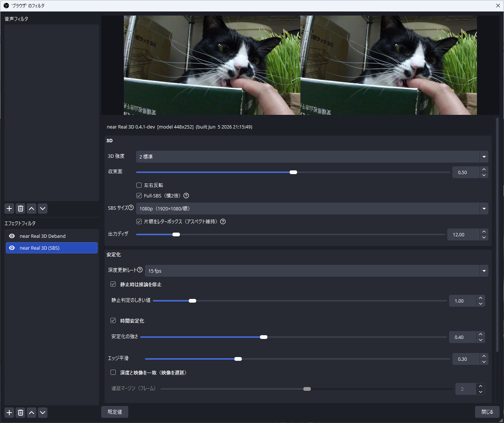
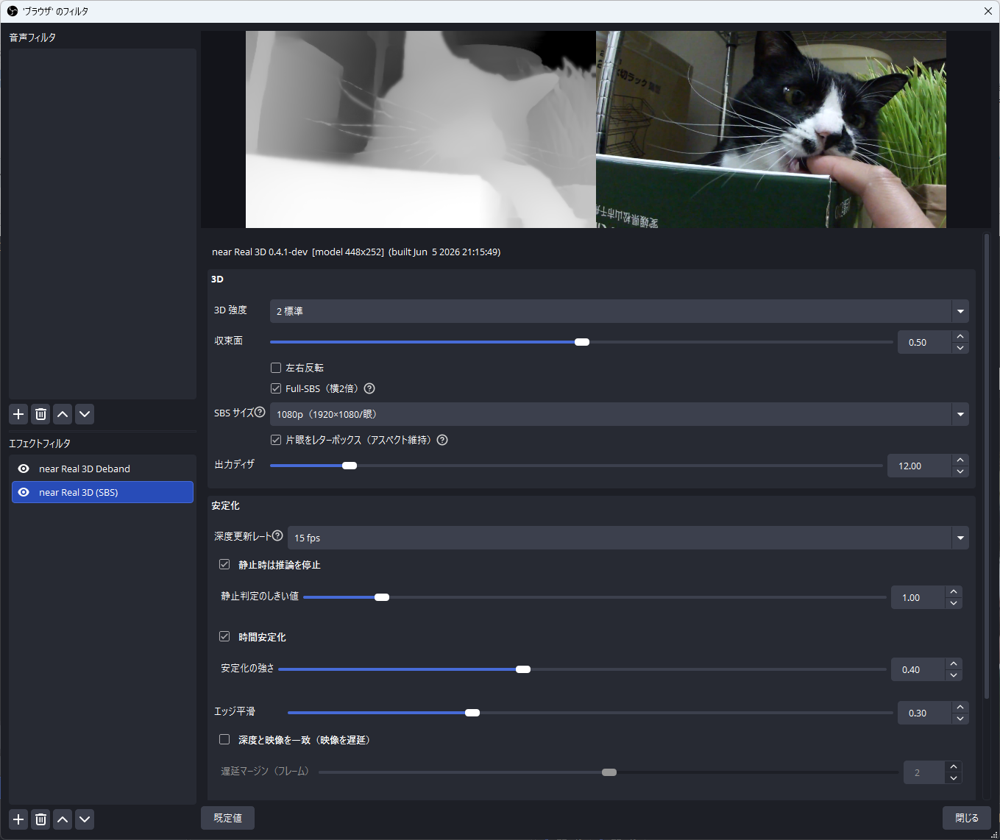

# near Real 3D

**単眼深度推定で 2D 映像をリアルタイムに Side-by-Side 立体化する OBS 32 用ネイティブ動画フィルター。**
XREAL One シリーズの「REAL 3D」(平面映像を擬似立体で見せるモード)を、専用ハードなしに OBS の中だけで擬似的に再現する。

> モジュール名/バイナリ: `obs-near-real3d` ／ フィルター表示名: **near Real 3D (SBS)**

<p align="center">
  
</p>

ソースに適用すると、そのソースのプレビュー/出力が **左右2枚(SBS)の立体映像**になる。
1枚絵から単眼深度を推定し、深度から左右の視差を作って GPU シェーダで warp する。
`obs-backgroundremoval` と同じ「ONNX 推論を OBS フィルター内で回す」構造で、外部アプリ不要。

---

## 仕組み: 単眼深度から視差をつくる

立体視の原理は単純で、**左右の眼で見える像が水平にわずかにずれている**こと(視差/parallax)。
近い物ほどずれが大きく、無限遠ではずれない。このフィルターは 1 枚の 2D フレームから

```
RGB フレーム ──▶ ① 単眼深度推定 ──▶ ② 深度→視差 ──▶ ③ バックワード warp ──▶ 左右 SBS 出力
                     (ONNX/GPU)        (収束面+強度)      (各眼で逆方向)
```

という流れで擬似的な左右像を合成する。

### ① 単眼深度推定 (monocular depth)

<p align="center">
  
</p>

<p align="center"><sub>デバッグの「深度マップを表示」: 左＝推定した相対逆深度(近いほど明るい) / 右＝原画</sub></p>

- **Depth Anything V2 (Small)** を ONNX 化し、**ONNX Runtime + DirectML**(DX12 GPU)で推論。
- 入力は **448×252**(16:9、`INFER_W`×`INFER_H`)に縮小。ソース/各眼と同じ 16:9 なのでアスペクト無歪み。縮小は**逐次 2:1 ハーフリング**（手動 mip ピラミッド。一発の大縮小はバイリニア 2×2 タップでアンダーサンプリングし、エイリアス＆圧縮バンディングを通すため、各軸を 2:1 で繰り返し面積平均）＋任意で**軽い平滑**を掛け、トーンジャンプが深度の段差として拾われるのを抑える。出力は **相対的な逆深度**(近いほど大)を `[0,1]` に正規化したもの。絶対距離ではなく「手前/奥の順序」を表す。
- OBS の描画スレッドとは別の**ワーカースレッドで非同期推論**し、結果を深度テクスチャ(`R32F`)としてアップロード。**warp(表示)は毎フレーム、深度の更新だけを指定レート**(既定 15fps)で回すことで負荷を抑える。

### ② 深度 → 視差 (disparity)

各画素の深度 `d` から、水平方向のずらし量(視差)を作る:

```hlsl
disp = strength * (d - convergence)
```

- **convergence(収束面)**: 視差ゼロになる深度 = スクリーン面。`d > convergence`(手前)は正の視差で**飛び出し**、`d < convergence`(奥)は負で**引っ込む**。
- **strength**: 基線長(両眼間隔)に相当するスケール。`0` で視差なし=完全フラット(深度処理は走ったまま立体だけ無効。A/B 比較用)。
- **立体グレーディング(S字, 任意)**: `e = d - convergence` を収束面から各端点までの片側レンジで正規化し、奇関数の `tanh` S字を掛けて視差を非線形化する。中距離を濃くしつつ近景/遠景の端点視差は保つので、**同じ最大視差のまま中距離の奥行きを濃く**でき、最前景シルエットの裂け(後述のラバーシート)が増えにくい。単調かつ `e=0` で 0 なので**深度順序と収束面は保たれる**。既定 0(=直線)。
- **シルエット保護(任意)**: warp が実際にサンプルする**左右方向**だけを見て、人物/物体の輪郭など横方向の深度段差で視差を局所的に弱める。平坦部や縦方向の細部は保ちつつ、強い視差で出る輪郭の裂け・背景の引き伸ばしを抑える。上げすぎると輪郭付近の 3D は少し丸くなる。既定 0.35。
- **左右で符号を反転**: 左眼と右眼は逆方向にずらす(**左右反転** で入れ替え可)。

### ③ バックワード warp と SBS 合成

出力フレームを左右半分に割り、**各出力画素について「ソースのどこをサンプルすべきか」を逆算**する(inverse/backward warp):

```hlsl
// 出力 uv からどちらの眼か判定し、その眼のフル画面 uv(euv)に復元
// 深度から視差 disp を求め、サンプル元 uv を眼ごとに逆方向へ水平シフト
suv = euv.x + sign(eye) * disp * 0.5;
color = image.Sample(linClamp, suv);   // ソースを引いてくる
```

- 画素を**飛ばす** forward warp ではなく、出力から**引いてくる** backward warp なので穴が空かず実装が単純・GPU 1 パスで済む。
- 代償として、**前景の陰に隠れていた背景(disocclusion)は黒穴でなく引き伸ばし**になる。急な深度段差(前景シルエット vs 遠景)で視差を強くすると輪郭が裂ける——DIBR 特有の "rubber-sheet" アーティファクト。**シルエット保護**で横方向の段差をまたぐ warp だけ視差を弱め、**エッジ平滑**(深度エッジの Gaussian 平滑)で深度段差自体をなだらかにして緩和する(mesh-warp 相当の近似)。視差量に比例して悪化するので、効果は控えめが基本。

### 補足: 時間安定化と色空間

- **時間安定化(flicker 対策)**: 単眼深度モデルはフレーム独立推論なので、画面のどこかが動くと**静止領域の深度まで毎フレーム揺れる**(breathing。MiDaS/DPT/DA V2 共通の限界)。対策として **自前実装の軽量オプティカルフロー(ピラミッド型 Lucas-Kanade)で前フレーム深度を動き補償ワープ → 残差に応じて適応合成**し、加えて正規化レンジを EMA 平滑。動く前景の残像を抑えるため、**現在深度の局所範囲へ過去深度を制限する history clipping** と **高速移動・フロー失敗付近の履歴を捨てる reactive mask** を常時併用する(`flow_stabilizer.hpp`)。
- **シーンチェンジ対策**: 深度は非同期で遅れるため、カット直後は前シーンの深度で新フレームを歪めて視差が一瞬乱れる。対策として描画スレッド側でフレーム間差分から**カットをキャンバス FPS で検出**し、(1)推論レートを無視して**追加推論を即投入**、(2)**表示中フレームに一致する深度が無い間だけ視差をフラット化(2D)**して前シーンの深度で歪めない、対応深度が届いたら視差をなめらかに戻す。フラット判定は「表示フレームの世代に合う深度がキャッシュに有るか」で行う(下記「深度と映像の一致」では前シーン深度がキャッシュに残るため、このフラット化はほぼ回避され 3D が維持される)。
- **深度と映像の一致(任意)**: 通常は最新フレームに*少し過去の*深度を当てるため、動き中は深度シルエットが画像から遅れる。設定の **深度と映像を一致** を有効にすると、(1)直近のフルレスフレームをリング保持して映像を実測レイテンシぶん遅延表示し、(2)深度も**世代(シーン)＋撮影タイムスタンプで対応付けた小さなキャッシュ**から、いま表示するフレームに合う1枚を選んで warp する。これで定常ズレを解消し、さらに**ハードカットを跨いでも前シーンの深度がキャッシュに残るため 3D を維持**できる(旧来はカット直後に一瞬 2D へ落ちていた)。**遅延マージン**(下記)は実測レイテンシに数フレーム上乗せして、カット直後の新シーン深度が映像より先に届くことを保証し、カット時の一瞬の 2D を消す。**音声もソースの同期オフセットで自動的に同じだけ遅延**して A/V を保つ。追加 VRAM(深度キャッシュは `R32F` 数枚で小さい)と出力遅延と引き換え(ライブ配信では遅延は配信側バッファに吸収されやすい)。
- **色空間(sRGB) / SDR 推奨**: フィルターは `OBS_SOURCE_SRGB` を宣言し、リニアライト・パイプラインの状態を取得/描画の各パスで整合させる。これにより sRGB タグ付きソース(動画など)が **decode されっぱなしで暗く沈むことなく**正しい明るさで立体化される。**取り込みバッファは 8bit RGBA で SDR(sRGB) のみを対象**とするため、OBS の **詳細設定 → 映像 → 色空間は Rec.709(SDR) を推奨**。**Rec.2100(PQ/HLG) などの HDR キャンバスでは 1.0 超のハイライトが 8bit に丸められ、白飛び・色破綻が起こり得る**(深度推定・3D 化自体は動くが色がおかしくなる)。一方 **レンダラー / カラーフォーマット(NV12 等) / 色範囲(リミテッド/フル)** は出力エンコード段やキャプチャ API の設定で、フィルタは常にフルレンジ RGBA で処理するため **どれを選んでも 3D 化には影響しない**。

---

## インストール（Windows）

[Releases](https://github.com/8796n/obs-near-real3d/releases) から最新版を入手:

- **インストーラ（推奨）**: `near-real3d-x.y.z-windows-x64-installer.exe` を実行。`%PROGRAMDATA%\obs-studio\plugins\obs-near-real3d\` へ配置されます（管理者不要）。**OBS を閉じてから**実行し、終わったら OBS を再起動。
- **ポータブル ZIP**: `near-real3d-x.y.z-windows-x64.zip` を展開し、中の `obs-near-real3d` フォルダを **`%PROGRAMDATA%\obs-studio\plugins\`** に置く（→ `…\plugins\obs-near-real3d\bin\64bit\…`）。

> **通常版 / 軽量版（`-lite`）**: 各リリースには既定の **448×252** モデル同梱版と、**392×224** モデル同梱版（`…-lite-installer.exe` / `…-lite-…zip`）の2種類があります。`-lite` は **full とほぼ同等の深度品質**のまま **約 1.4 倍速**で、**AMD などの非力な iGPU** で 3D 化が重いときに有効。プラグイン本体は共通で、**同梱する深度モデルだけが違う**ので、両方を入れる必要はなく片方を入れれば置き換わります。どちらが動作中かは OBS のログ `[near-real3d] depth model loaded (WxH)` か、フィルタ設定画面トップの `[model 392x224]` 表示で確認できます。

導入後、ソースを右クリック → **フィルタ** → **+** → **near Real 3D (SBS)**。

> 署名前のため、初回は SmartScreen/AV の警告が出ることがあります（「詳細情報」→「実行」）。
> 必要環境: **Windows x64 / DirectML が動く DX12 GPU**。VC++ ランタイムは OBS 同梱で通常そのまま動作。

## 動作環境(検証済)

- **OBS Studio 32.1.2**(ABI 一致のヘッダをこのバージョンで取得)
- **Windows / DirectML が動く DX12 GPU**(検証: RTX 3060) — DirectML EP のため現状 **Windows x64 専用**
- ビルド: **MSVC**(VS 2022/18, cl 19.5x)+ 同梱 **CMake / Ninja**
- 深度モデル `depth_anything_v2_small.onnx`(Apache-2.0)を同梱(リリース成果物 / `models/`)

## ソースからビルド (Windows)

```powershell
.\setup.ps1     # 依存取得: obs ヘッダ + obs.lib / ONNX Runtime(DirectML)
.\build.ps1     # MSVC + Ninja でビルド → build\obs-near-real3d.dll
.\install.ps1   # %PROGRAMDATA%\obs-studio\plugins\obs-near-real3d\ へ配置(管理者不要)
```

`install.ps1` は plugin DLL・`onnxruntime.dll`・`DirectML.dll`・
`data\` 一式（`near-real3d.effect` / `deband.effect` / `locale\*.ini`）・深度モデルを
所定の `bin\64bit` / `data` に配置する。

> Windows の OBS ユーザープラグインパスは `%APPDATA%` ではなく
> **`%PROGRAMDATA%\obs-studio\plugins\<module>\bin\64bit`**
> (`frontend/widgets/OBSBasic.cpp` の `GetProgramDataPath` + `/bin/64bit`)。

## 使い方

1. OBS を起動 → ソースを右クリック → **フィルタ** → **+** → **near Real 3D (SBS)**。
2. そのソースのプレビュー/出力が左右2枚(SBS)の立体になる（既定は **Full-SBS**＝横2倍。下記「Half-SBS と Full-SBS」参照）。
3. フィルタ設定は **3D / 安定化 / デバッグ** の3グループ（各項目はホバーで詳細ツールチップ）。以下は UI 表示どおりの日本語ラベル。

   **3D**
   - **3D 強度**（0–4、既定 2。視差量。**0=視差なし(フラット)** で深度処理は走ったまま立体だけ無効化 → A/B 比較用）
   - **収束面**（0–1、既定 0.5。スクリーン面=視差ゼロの深度。上げるほど手前に飛び出す）
   - **立体グレーディング（S字）**（0–1、既定 0。深度→視差の対応を直線から `tanh` の S字へブレンドし、近景/遠景の端点視差は保ったまま中距離の立体感を強める。`3D強度`を上げるのと違い、最大視差(と輪郭破綻)を上げずに中距離の奥行きを濃くできる。深度の順序と収束面は不変。**0=直線(従来どおり)**）
   - **シルエット保護**（0–1、既定 0.35。人物や物体の輪郭など、横方向の深度段差で視差を局所的に弱める。実際に warp がサンプルする左右方向だけを見るため、平坦部や縦方向の細部は保ちやすい。強い視差で出る輪郭の裂け・背景の引き伸ばしを抑える。高すぎると輪郭付近の 3D が少し丸くなる。0=オフ）
   - **左右反転**（立体が反転して見えるとき）
   - **Full-SBS（横2倍）**（**既定 on**。off=Half-SBS。下記参照。横2倍出力なのでベース/出力解像度も横2倍に）
   - **SBS サイズ**（片眼の出力解像度。`ソース基準`＝従来どおりソース寸法 / `1080p（1920×1080/眼）`＝片眼 1920×1080 固定。Full-SBS なら 3840×1080、Half-SBS なら 1920×1080 を出力し、ソース寸法に依らずグラス向けの SBS フレームになる。OBS のキャンバス/出力も同じサイズにすると 1:1）
   - **片眼をレターボックス（アスペクト維持）**（既定 off。アスペクト維持で各眼にソースを収め余白を黒帯に。**非16:9 ソースを固定 SBS サイズで扱うとき**用。眼=ソースのアスペクトが一致なら無効）
   - **出力ディザ**（0–100、既定 12。3D 出力時に微小な静的ディザ(三角分布 TPDF)を加え、**warp 自身の 8bit 再量子化が再生成するバンディング**(暗部グラデで顕著／warp が引き伸ばす領域も)を出力解像度で隠す。`near Real 3D Deband` が**ソース側の既存バンドを除去**するのに対し、これは**warp が新たに作る段差**を抑えるもので役割が異なる。0=オフ）

   **安定化**
   - **深度更新レート**（GPU 負荷。10/15/24/30/60fps、既定 15。**24fps は映画ソース向け**）
   - **静止時は推論を停止**（チェック付きグループ、既定 on。ほぼ静止している間は ONNX 推論をスキップしキャッシュ深度を再利用。表示=warp は毎フレーム継続）
     - **静止判定のしきい値**（0–8、0.1刻み、既定 1.0。縮小フレームの平均色差がこれ以下なら静止扱い。画面キャプチャはほぼ 0 で即スキップ、カメラ入力はノイズに合わせ上げる）
   - **時間安定化**（チェック付きグループの**ヘッダーチェックで ON/OFF**、既定 on。フロー誘導の時間平滑で深度のフレーム揺れを抑える。残像対策(history clipping + reactive mask)は常時適用）
     - **安定化の強さ**（0–1、既定 0.4。上げるほど安定・動きは僅かに遅延・残像寄り）
     - **低信頼シーンで3Dを自動的に弱める**（既定 on。深度が当てにならないシーン(空・星空・霧・平坦UI・強いカメラブレ)で 3D 強度を自動的に下げ「暴れない」を優先。信頼度は安定化の**フレーム間深度残差**から求めるため**本グループの子**(時間安定化 off 時は無効)。完全な 2D には落とさず下限あり）
   - **エッジ平滑**（0–1、既定 0.3。深度エッジを平滑化し、強い視差での輪郭破綻=ラバーシートを低減）
   - **深度と映像を一致（映像を遅延）**（チェック付きグループ、既定 off。映像表示を実測の深度レイテンシ(~0.1s)ぶん遅らせ、表示フレームに**世代＋撮影タイムスタンプで対応する深度**を当てて動き中の“深度が遅れる”ズレを解消し、**ハードカットを跨いでも 3D を維持**する。**追加 VRAM＋出力遅延**と引き換え。音声は自動で同じだけ遅延し A/V を保つ。ライブ配信では遅延は配信側バッファに吸収されやすい）
     - **遅延マージン（フレーム）**（0–4、既定 2。本トグル on のときだけ有効。実測レイテンシに上乗せする追加遅延フレーム数。カット直後の新シーン深度を映像より先に届かせ、カット時の一瞬の 2D を防ぐ。0=レイテンシちょうど(たまに 1 フレームだけ 2D が出る)。上げるほど確実だが出力遅延が増える）

   **デバッグ**
   - **深度マップを表示（左:深度 / 右:原画）**（左=深度マップ / 右=元画像を並べて表示。深度と原画を見比べられ、静止スキップ中は深度が固定・原画のみ更新されるので、静止判定しきい値の効きを目視確認しやすい）
   - **深度マッチ状態で着色**（表示フレームに合うキャッシュ深度が無い=2D フォールバック中は**赤**、視差ランプ復帰中は**黄**、フル 3D は無着色。ハードカット直後の挙動を一目で確認できる。検出カットと 2D 継続 ms を OBS ログにも出力。ONNX 深度の稼働中のみ有効）
   - **深度キャッシュ無効（1枚・A/B）**（深度キャッシュを実効 1 枚に制限し、キャッシュ導入前の「最新深度のみ」挙動を再現。遅延モードで本項 on/off を切り替えると、カット跨ぎの 3D 維持の効きを同じ素材で比較できる）

### デバンドフィルタ（near Real 3D Deband）

色のバンディング（空・フェード・暗部のグラデーションに出る縞・段差）を **mpv 方式**で低減する**独立フィルタ**（フィルタ追加メニューの **near Real 3D Deband**）。浅い段差だけを埋める確率的ぼかし(実エッジは保持)＋わずかな静的グレインを、**ソース解像度 1:1** で適用。`mpv --deband` 相当のアルゴリズムで、**反復回数 / しきい値 / 範囲(半径) / グレイン**を調整可、**既定は控えめの 1 / 12 / 4 / 9**（mpv 既定 1/48/16/48 はしきい値・グレインが強めなので暗部向けに穏やかな値へ）。

- **3D と併用するときは本フィルタを near Real 3D の〈上〉に並べる**（`ソース → near Real 3D Deband → near Real 3D`）。フィルタは上から順に適用されるので、warp の前にソースをデバンドし、**深度推論の入力も綺麗になる**（バンディングを深度の段差と誤読しにくい）。1:1 描画ゆえ Full-SBS の左右ぶんを二度処理するより**タップ数も少ない**。**順序を間違えて Deband を下に置くと**、near Real 3D のフィルタ設定に**警告**が出る（設定パネルを開いた時点で判定）。
- **しきい値**は「どの大きさの段差まで平滑するか」の境界。linear 光で処理するため**暗部では概ね 10〜15 以下が効く帯域**（48 以上は明部のディテールを削る側）。**グレインを 0 にすると平滑だけを切り出して確認**しやすい。
- グレインはピクセル基準でシードするので**時間的に静止**（チラつかない）。3D を使わない通常ソースのバンディング低減にもそのまま使える。
- 本フィルタは**ソースの既存バンド**を消すもの。**warp 自身の 8bit 再量子化**で出る段差は、ソースを綺麗にしても warp 出力で再量子化されるため完全には防げない。これには near Real 3D 側の **出力ディザ**（既定 12）が効く。両者は役割が異なる（Deband=ソースの既存バンド除去 / 出力ディザ=warp が作る段差の抑制を出力解像度で）。

### Half-SBS と Full-SBS

- **Half-SBS**: 出力はソースと同寸 W×H。各眼を W/2 に 2:1 横圧縮した真のアナモルフィック SBS(3D TV / VR / SBS 対応グラスが左右に引き伸ばして見る標準形式)。フル解像度ソースをサンプルするので拾いは綺麗。
- **Full-SBS（既定）**: 出力 2W×H、1 眼フル解像度。シェーダは同じで `get_width` が 2W を返すだけ。
  **注意**: OBS のキャンバス/出力解像度が W のままだと 2W ソースが縮小され結局 Half 相当に戻る。効果を出すにはチェーン全体を 2W 幅に(例: ベース/出力 3840×1080)。

**グラス（XREAL 等）へ送るには**: 最終フレームのサイズを決めるのは **OBS のベース/出力解像度**（プラグインは変えられない）。`SBS サイズ = 1080p` にすると片眼が常に 1920×1080 になり、**Full-SBS → キャンバス 3840×1080**／**Half-SBS → 1920×1080** に合わせれば、ソース寸法に依らずグラスにそのまま出せる。非16:9 ソースは **片眼をレターボックス** で各眼を 16:9 に収める（黒帯）。16:9 ソースなら `ソース基準` のままでも 3840×1080 キャンバスで正しく出る。

SBS 対応のグラス/ディスプレイへ送るなら、SBS 出力したシーンを全画面表示し、デバイス側の SBS モードで見る(その場合は Half-SBS が標準)。

## パフォーマンス(GPU 負荷)

深度推定は**連続でニューラルネットを GPU 推論**するため本質的に重い(GPU を OBS の描画と共有)。RTX 3060 / DirectML 実測。

**通常版 vs 軽量版（RTX 3060 / DirectML / FP16, ONNX 1回の median 実測）** — どちらも同じ DA V2 small（重み共通・≈50MB）で、違いは入力解像度＝計算量だけ。プラグインは同梱モデルの入力形状から推論寸を自動取得するので、`-lite` 同梱版を入れるだけで切り替わる（コード変更不要）。

| モデル | 入力(16:9) | ViT トークン | ONNX 1回 | 相対 |
|---|---|---|---|---|
| **通常版**（既定） | 448×252 | 576 | **7.5 ms** | 1.0x |
| **軽量版** `-lite` | 392×224 | 448 | **5.4 ms** | **1.4x 速** |

軽量版は **full と同等の深度品質**（深度 std 同値）のまま約 1.4x 速。**もっと攻めた 224×126(144トークン)も試したが、DA‑V2 が被写体構造を解像できず深度がのっぺり崩壊**したため不採用（PyTorch FP32 でも同様＝書き出しではなく解像度の限界）。実測の崩壊閾値は ~336 トークンで、**品質を保てる下限として 392×224 を採用**。非力な iGPU ほど効果が出る。（参考: 16:9 化で正方 392²(10.8 ms)より通常版が ~0.71x 軽い＝576 vs 784 トークン。アスペクトも無歪み）

**精度(量子化)別 参考**(同一入力での比較。下段は 392² 時の実測):

| 形式 | 1 回(392²) | サイズ | FP32 との誤差 | 備考 |
|---|---|---|---|---|
| FP32 | 20.0 ms | 99MB | — | |
| **FP16** | **10.8 ms** | 50MB | 0.012 | ~1.85x 速・無劣化・FP32 I/O ドロップイン（**既定**。実寸は通常版 448×252=7.5ms / 軽量版 392×224=5.4ms） |
| INT8 動的 | 25.8 ms | 27MB | 0.67 | DirectML では**遅い**(非加速) |
| INT8 静的 QDQ | 569 ms | 27MB | 1.63 | DirectML では激遅。NPU 向けの正しい形式 |

→ **PC/DirectML では FP16 が最適**。推論コストは ~ViT トークン数 `(W/14)×(H/14)` に比例（参考 FP32: 518²=42.9ms / 392²=20.6ms / 308²=11.1ms）。
**dynamic-axes は DirectML で約 5 倍遅いので固定サイズ必須**。

**深度ワーカーは「ONNX 推論 → 時間安定化」を直列処理**する点に注意。RTX 3060 実測で時間安定化（自前オプティカルフロー）は約 **28ms**、安定化全体で約 **35ms**。ONNX(通常版 448×252 FP16 ~7.5ms)と合わせると **1 深度フレーム ≈ 43ms** になり、**時間安定化 ON では実効の深度更新は ~20fps が上限**（それ以上を選んでもワーカーが追いつかず一部フレームは間引かれる）。**30/60fps を活かすなら時間安定化を OFF**（ONNX のみ ~8ms）にするか、より高速な GPU/CPU が要る。軽量版(392×224)なら ONNX が ~5.4ms、時間安定化も画素数比で約 0.78 倍に下がるため、この上限が少し上がる。warp（表示）は常に毎フレーム。

軽くしたいとき: **軽量版（`-lite`）インストーラを使う**（392×224 モデル同梱、上記参照）/ **静止時は推論を停止**(既定 on)/ **深度更新レートを下げる** / **時間安定化を OFF** / 入力ソース解像度を下げる。別寸が要れば `tools/export_onnx.py --width … --height …` で再エクスポートし、その `.onnx` を同梱するだけ（プラグインがモデルから寸法を読むのでコード変更は不要）。

> 推論解像度を下げても **SBS の出力解像度は不変**(深度マップの精細さだけが変わる)。深度は低周波情報なので解像度を落としても立体感への影響は小さい。

> 計測の見方: 静止スキップが効くと GPU の**絶対負荷・消費電力(W)は実際に下がる**(クロックが例 1900→700MHz)が、タスクマネージャ等の **使用率%** はクロック低下に伴い数秒で元水準へ戻って見える(DVFS による見かけ上の上昇)。実負荷は **GPU Clock(MHz) / Power(W)**(GPU-Z / HWiNFO64 / Afterburner)で見る。

## 既知の制約 / 今後

- フィルタ作成時に ONNX セッション初期化 + モデルロードで **~1.3 秒**(インスタンスごと)。共有セッション化で短縮余地。
- 深度はソース/各眼と同じ **16:9(448×252、`-lite` は 392×224)** で推論するためアスペクト無歪み（旧 392² 正方の横圧縮を解消）。**推論寸は同梱モデルの入力形状から自動取得**（`OrtDepth::Init`）。別寸へは `tools/export_onnx.py` で再エクスポートして差し替えるだけ（モデル無し時のフォールバック寸は `DEFAULT_INFER_W/H`）。
- backward warp ゆえ disocclusion は黒穴でなく引き伸ばし。**急な深度段差 × 強い視差で輪郭が裂ける(DIBR ラバーシート)**。`エッジ平滑` で緩和、根本解決は occlusion-aware forward warp + inpainting(重い)。
- **深度 flicker は単眼深度モデル固有の限界**(時間的一貫性なし)。フロー誘導の時間安定化で実用域まで抑制(上記「仕組み」参照)。
- **平坦/構造の乏しい映像(空・星空・霧・グラデーション・抽象)は苦手**: そこに*実際の奥行きが無い*ため、単眼深度は輝度やテクスチャから深度を捏造する(星空なら天の川の帯を「近い」と誤推定する等)。視差を付けると不自然になりやすいので、この種のソースでは **3D強度を下げる/オフ**を推奨。**安定化グループの「低信頼シーンで3Dを自動的に弱める」(既定 on、時間安定化 on 時)** がこの抑制を自動化する。逆に**前景・背景が明確な被写体**(人物・物・室内・風景)が得意領域。
- **真の動画深度モデル(Video Depth Anything)は不採用**: 時間一貫性が KV-cache(ステートフル)依存で公式に ONNX 書き出し不可、性能的にも 3060+DirectML で非現実的。よってフロー誘導で代替。
- 深度推論は既定 15fps なので激しい動きで段付きが残りうる(warp は毎フレーム)。深度更新レートを上げると緩和。
- **HDR キャンバス(Rec.2100 PQ/HLG)は非対応**: 取り込みが 8bit SDR(sRGB) 固定のため、HDR ソースはハイライトが丸められ色破綻し得る。**OBS 詳細設定 → 映像 → 色空間は Rec.709(SDR) 推奨**(レンダラー/カラーフォーマット/色範囲は 3D 化に影響しない)。HDR 化には取り込みバッファの 16F 化＋色空間判定の拡張に加え、深度入力(SDR 学習モデル)用に SDR トーンマップ経路を分離する必要があり、別タスク。
- sRGB 厳密化は対応済。DA V2↔DPT 切替 / 共有セッション化 / 非同期 readback は今後の候補。
- 現状 Depth Anything V2 Small 固定(別サイズ/別モデルへ差し替え可能)。

## 変更履歴 / 廃止された機能

- **v0.5.1**
  - **追加(3D)**: **シルエット保護** スライダ(0–1、既定 0.35)。warp が実際にサンプルする左右方向だけを見て、人物/物体の輪郭など横方向の深度段差で視差を局所的に弱める。平坦部や縦方向の細部を保ちながら、強い視差で出る輪郭の裂け・背景の引き伸ばしを抑える。
  - **修正(3D)**: **立体グレーディング(S字)が収束面 0/1 以外で最大視差を膨張**させていた不具合。`tanh` を収束面から各端点までの片側レンジで正規化するよう変更し、**任意の収束面で端点視差を保持**（既定の収束面 0.5 で従来 +64% 膨張していた）。
  - **修正(安定化)**: **低信頼の自動3D抑制を時間安定化 OFF で即無効化**（UI 説明どおり）。従来は信頼度の漸近に依存し、静止スキップ中などに抑制が残留し得た。
  - **内部(高速化)**: **時間安定化を高速化**（画質ほぼ不変）。`edgeSoftenDepth` の Gaussian を **box近似(O(n))**、`maxFilter` を **O(n) sliding-window-max** 化（半径非依存）、さらに**オプティカルフローを半解像で計算**。RTX 3060 実測で深度1フレームの処理を大きく短縮し、深度更新の実効レート上限を引き上げる。内訳は **デバッグ「深度マッチ状態で着色」** ON 時のログ（`stab perf: onnx | flow | edge | other | total`）で確認可。
  - **内部**: **バージョン番号を `CMakeLists.txt` の `project(VERSION)` に一本化**。`plugin-main.cpp` / `installer.iss` のフォールバックはセンチネル化し、`package.ps1` は CMakeLists から導出。版数変更は1行で済み、リリースはタグのみ。
- **v0.5.0**
  - **追加(3D)**: **立体グレーディング(S字)** スライダ(0–1、既定 0)。深度→視差を直線から `tanh` の S字へブレンドし、中距離の立体感を強めつつ近景/遠景の端点視差は保つ。**同じ最大視差のまま中距離の奥行きを濃く**できるため、最前景シルエットの裂け(DIBR ラバーシート)が増えにくい。単調・`e=0` で 0 ゆえ深度順序と収束面は不変。0=直線(従来挙動)。
  - **追加(安定化)**: **低信頼シーンで3Dを自動的に弱める**(既定 on、**時間安定化グループの子**)。フロー補償後の深度残差のフレーム平均から*シーン信頼度*を求め、空・星空・霧・平坦UI・強いカメラブレなど深度が不安定/捏造されがちな場面で視差倍率を自動で下げる(下限ありで完全 2D にはしない)。「外しを当てにいくより暴れない」を自動化。時間安定化 off では無効。
  - **追加(i18n)**: **簡体字中国語ロケール** `data/locale/zh-CN.ini`。OBS の言語が簡体字なら自動適用(無ければ en-US フォールバック)。
  - **改善(UI)**: **3D強度/左右反転にツールチップを追加**(チェックボックス・ドロップダウンには「?」ヘルプアイコンが揃う。スライダーは OBS 仕様上「?」が付かず数値ボックスにホバーでヘルプ)。**全ツールチップを改行整形**して横長を解消。
  - **メモ(制約)**: **HDR キャンバス(Rec.2100 PQ/HLG)は非対応**を明記(取り込みが 8bit SDR 固定。OBS 詳細設定→映像→色空間は Rec.709/SDR 推奨。レンダラー/カラーフォーマット/色範囲は 3D 化に影響しない)。
  - **修正(遅延モード)**: **シーンチェンジのたびに音声同期オフセットが微動してプチプチする不具合**。深度レイテンシ EMA に**カット時の強制(off-cadence)推論の標本まで混ぜていた**ため、カットごとに推定が揺れて `commit_delay`→音声オフセットが1フレーム単位でハンチングし、OBS の音声再タイミング(クリックノイズ)を誘発していた。強制推論にフラグ(`in_forced`/`out_forced`)を付け、その標本を EMA から除外して根治。
- **v0.4.1**
  - **修正(重要)**: **軽量版の深度崩壊**。v0.4.0 の `-lite`(224×126) は ViT トークンが 144 しかなく、DA‑V2 が被写体構造を解像できずに深度がのっぺり崩壊していた（3D化が破綻）。**書き出しではなく解像度の限界**（PyTorch FP32 でも同様）。崩壊閾値 ~336 トークンを踏まえ、軽量版を **392×224（448トークン）に変更**。RTX 3060 / DirectML / FP16 で **5.4ms（full比 1.39x 速）・深度品質は full と同等**。**v0.4.0 の軽量版を入れた方は v0.4.1 に入れ替えてください**（通常版は影響なし）。
- **v0.4.0**
  - **追加**: **軽量版モデル** と、**通常版 / 軽量版(`-lite`) の 2 インストーラ配布**。重みは同じ DA V2 small（≈50MB）で入力解像度＝計算量だけを下げる。プラグイン本体(DLL)は共通で、同梱する `.onnx` が違うだけ。（※当初の 224×126 は深度が崩れたため **v0.4.1 で 392×224 に変更**。上記参照）
  - **変更(内部)**: **推論寸法をモデルの入力形状から自動取得**（`OrtDepth::Init`）。旧 `INFER_W/INFER_H` 定数は廃止し、モデル無し/init 失敗時のフォールバック寸 `DEFAULT_INFER_W/H`(448×252) のみ残置。別寸モデルは**コード変更なしで差し替え**可能に。
  - **追加(UI)**: フィルタ設定画面トップの識別行に、**動作中モデルの寸法**を表示（例 `[model 392x224]`）。ログを見なくても通常版/軽量版を判別できる。
  - **改善(ツール)**: `tools/export_onnx.py` は CUDA 不可時に黙って FP32(99MB)へフォールバックせず、原因と対処を示して**エラー停止**するよう変更（FP16 書き出しは CUDA 必須。後変換での FP16 化は本モデルの pos-embed Resize 等が壊れるため不可）。
- **v0.3.2**
  - **改善**: **Frame-matched depth(深度と映像を一致)** を強化。深度を「最新 1 枚」から**世代(シーン)＋撮影タイムスタンプ対応の小キャッシュ**に変更し、リング遅延した表示フレームに合う深度を選択。**ハードカットを跨いでも前シーンの深度が残り 3D を維持**する(旧来はカット直後に一瞬 2D に落ちていた)。カット検出の約 1 フレーム遅れを補正するリング世代の再タグも追加。
  - **追加**: **Delay margin(遅延マージン)** スライダ(0–4、既定 2)。実測レイテンシに上乗せし、カット直後の新シーン深度を映像より先に届かせてカット時の一瞬の 2D を防ぐ。**深度と映像を一致** トグルの子（親 off 時は無効化）。
  - **追加(デバッグ)**: **深度マッチ状態で着色**(2D フォールバック=赤 / ランプ=黄)、**深度キャッシュ無効・1枚**(旧挙動との A/B)、カット・深度レイテンシ分解のログ出力。
  - **修正(重要)**: **深度と映像を一致** の音声同期が累積する不具合。映像遅延を親ソースの sync offset に乗せていたが、OBS はこの値を永続化するため、毎セッション我々の遅延が焼き付き再読込で基準値として加算され、保存/再起動を繰り返すと音声が際限なく(1.5秒級まで)遅れ、映像とも非同期になっていた。乗せた分をフィルタ設定に記録し次回ロードで差し戻すことで累積を防止(手動編集も保持)。**既存の焼き付きは初回1回だけ詳細音声プロパティで同期オフセットを 0 にリセットが必要**。
- **v0.3.1**
  - **追加**: **Output dither**（near Real 3D / 3D グループ）— warp 自身の 8bit 再量子化が再生成するバンディング（暗部グラデで顕著／warp が引き伸ばす領域も）を、出力解像度で三角分布(TPDF)ディザによりマスク。0–100 スライダ（既定 12、0=オフ）。`near Real 3D Deband` が**ソースの既存バンド**を消すのに対し、こちらは**warp が新たに作る段差**を抑える別役割。
- **v0.3.0**
  - **追加**: 独立デバンドフィルタ **near Real 3D Deband**（mpv 方式のバンディング低減。「使い方 → デバンドフィルタ」参照）。当初は SBS 内蔵案もあったが、コード重複・Full-SBS で per-eye 2倍・深度入力を綺麗にできない等の理由で独立フィルタへ一本化（内蔵版は未リリース）。
  - **廃止**: **Smooth inference input（推論入力を平滑）** — 推論サイズ(448×252)への面積平均縮小が既にバンディングを十分均し、追加の Gaussian がほぼ冗長だったため。バンディング低減が必要なら **near Real 3D Deband** をソースの上流（near Real 3D の〈上〉）に置く。
  - 既存シーンに残る `input_smooth` 等の設定キーは無害（無視されるだけ・クラッシュなし）。

## ファイル構成

- `src/plugin-main.cpp` — フィルター本体(フレーム取得・推論オーケストレーション・warp 描画・SBS 出力)＋独立デバンドフィルタ(`near_real3d_deband`)
- `src/depth_infer.hpp` — ONNX Runtime(DirectML)単眼深度推論ラッパー
- `src/flow_stabilizer.hpp` — フロー誘導の時間安定化 + 正規化
- `data/near-real3d.effect` — 深度→視差 backward warp + SBS シェーダ(OBS effect)
- `data/deband.effect` — mpv 方式デバンドシェーダ(独立 `near Real 3D Deband` フィルタ用)
- `data/locale/{en-US,ja-JP,zh-CN}.ini` — UI 文字列(英語/日本語/簡体字中国語。OBS の言語設定で自動切替)
- `setup.ps1` / `build.ps1` / `install.ps1` — 依存取得 / ビルド / ローカル配置
- `package.ps1` / `installer/obs-near-real3d.iss` — 配布物（ZIP＋Inno Setup インストーラ）生成
- `.github/workflows/release.yml` — タグ push で CI ビルド→Release 添付
- `deps/get_onnxruntime.ps1` — ONNX Runtime(DirectML)の取得（PowerShell のみ）

## リリース（メンテナ向け）

配布物は **GitHub Actions** が自動生成します（`.github/workflows/release.yml`）。

> 深度モデルの生成は `tools/export_onnx.py`（Depth Anything V2 Small → ONNX、FP16・固定形状）。現行の同梱モデルは **16:9 の 448×252**: `python tools/export_onnx.py --width 448 --height 252` で `models/depth_anything_v2_small.onnx` を再生成（要 torch/transformers/onnx、FP16 は CUDA）。入力は 14 の倍数なら任意の W×H 可。**プラグインは同梱モデルの入力形状から推論寸を読む**ので、コード側の変更は不要（再エクスポートして差し替えるだけ）。軽量版は `python tools/export_onnx.py --width 392 --height 224 --out models/dav2_392x224.onnx`。

1. **一度だけ準備**: 深度モデルを安定した URL（GitHub Release アセット等）に置き、リポジトリの **Actions 変数**（Settings → Secrets and variables → Actions → Variables）に設定。モデルは巨大なので Git には含めない。
   - `MODEL_URL` … 既定（448×252）モデルの直リンク
   - `MODEL_SHA256` … そのモデルの SHA-256（**タグリリースでは必須**。未設定だと CI が失敗）。現行モデル（**448×252 / 16:9 / FP16**）の値:
     `3C8DE7CCC0FAA9E266B6389628B9823412F25D995202AB58D9306A50A185CC5C`
     （`Get-FileHash depth_anything_v2_small.onnx -Algorithm SHA256` で確認可。再生成は `tools/export_onnx.py --width 448 --height 252`）
   - `MODEL_LITE_URL` / `MODEL_LITE_SHA256` …（任意）軽量版 **392×224** モデルの直リンクと SHA-256。`MODEL_LITE_URL` を設定すると CI が `-lite` 成果物（`…-lite-installer.exe` / `…-lite-…zip`）も生成・添付する。未設定なら `-lite` はスキップ（タグリリースで `MODEL_LITE_URL` を設定したときは `MODEL_LITE_SHA256` も必須）。
2. **リリース**: `v0.3.1` のような **タグを push** すると、CI が 依存取得 → `-DPLUGIN_VERSION=<タグ>` でビルド → `package.ps1` で ZIP＋インストーラ生成（通常版、`MODEL_LITE_URL` があれば軽量版も）→ その Release に添付（バージョンはタグ由来。手動実行時は `0.3.<run_number>`）。
3. **ローカルでも生成可**: `setup.ps1` → `build.ps1` → `package.ps1 -Version 0.3.1` で `dist/` に ZIP（＋Inno Setup があればインストーラ）。軽量版は同じ DLL のまま `package.ps1 -Version 0.3.1 -Variant lite`（要 `models/dav2_392x224.onnx`）。初回や CI 整備前の手動アップロードに。

## ライセンス

**GPL-2.0-or-later**(OBS 本体と同じ)。時間安定化のオプティカルフローは自前実装で、リンクする依存は GPLv2 互換のものだけなので GPLv2 を選べる。
同梱物とライセンス: ONNX Runtime(MIT)/ DirectML(再配布可)/ Depth Anything V2 Small(Apache-2.0)。
詳細は [`LICENSE`](LICENSE)(GPLv2 全文)と [`THIRD_PARTY_LICENSES`](THIRD_PARTY_LICENSES) を参照（各全文はリリース成果物の `licenses/` に同梱）。
